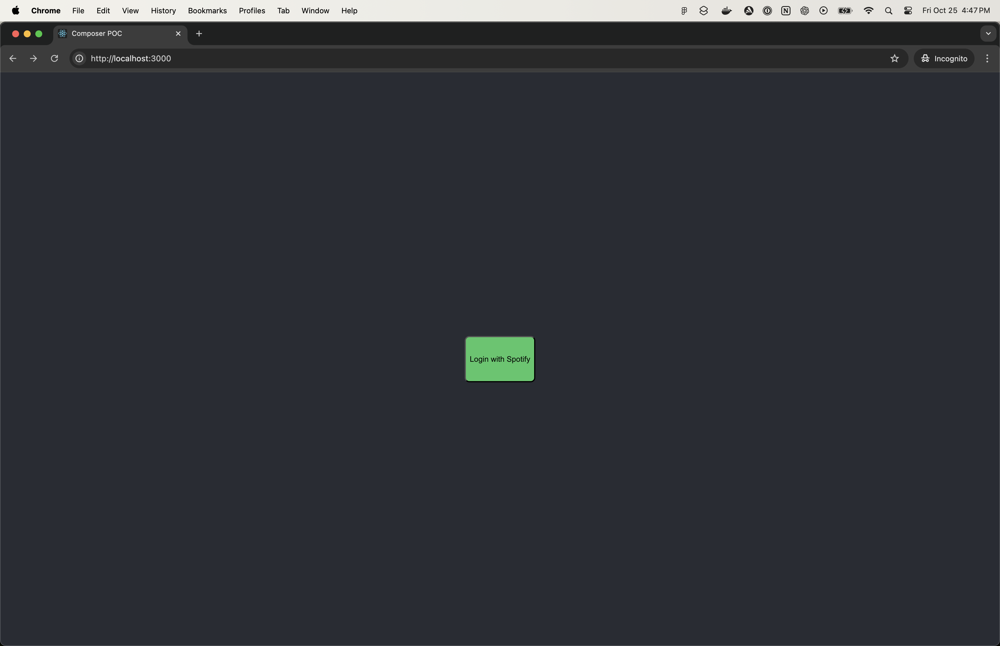
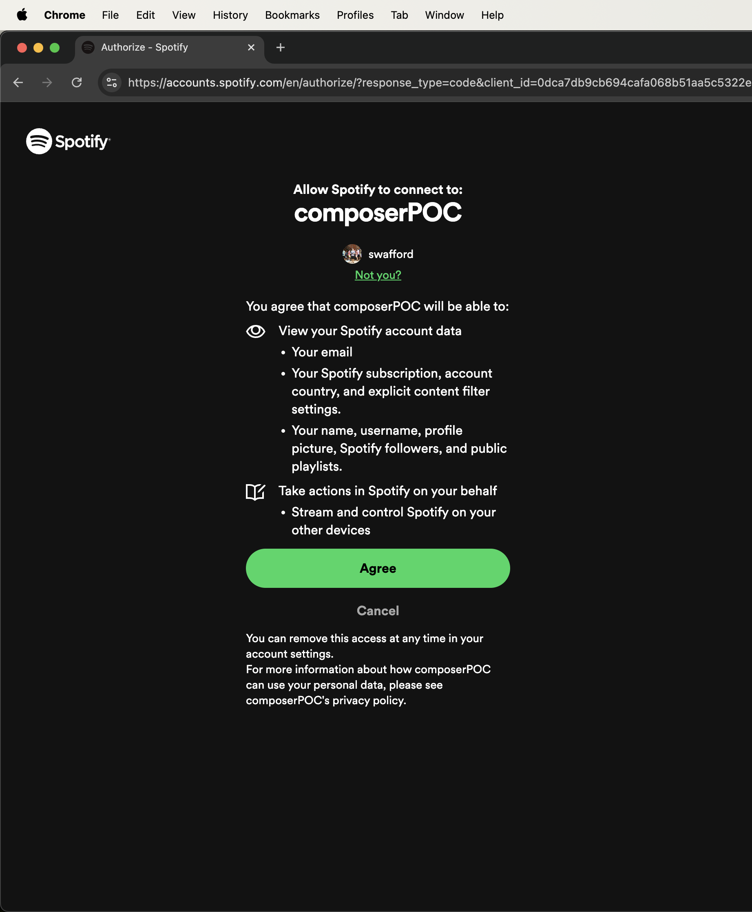
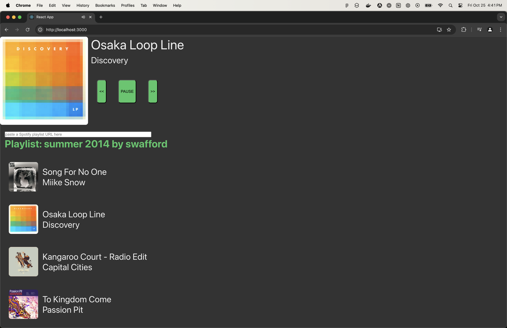

# Web Playback SDK Javascript Tutorial

This repository contains the source code for the [Web Playback SDK Guide](https://developer.spotify.com/documentation/web-playback-sdk/guide/).

Create a file called `.env` in the root folder
of the repository with your Spotify credentials,
which can be found in 1Password Shared vault under `Composer POC .env`

```bash
REACT_APP_SPOTIFY_CLIENT_ID='my_client_id'
REACT_APP_SPOTIFY_CLIENT_SECRET='my_client_secret'
```

## Installation

These examples run on Node.js version 16. On its
[website](http://www.nodejs.org/download/) you can find instructions on how to
install it.

Once installed, clone the repository and install its dependencies running:

```bash
npm install
```

## Running the example

Start both client and server with the following command:

```bash
npm run dev
```

The React application will start on `http://localhost:3000`

## Operation

(A Spotify Premium account is required to use the Web Playback SDK, therefore you need to have a Spotify Premium account to use this application.)

The application will prompt you to log in with Spotify.


Agree, then you can play a song from the Spotify playlist by tapping on it.

You can load any public playlist by entering its URI in the input field.

## Using your own credentials

You will need to register your app and get your own credentials from the
[Spotify for Developers Dashboard](https://developer.spotify.com/dashboard/)

To do so, go to your Spotify for Developers Dashboard, create your
application and register the following callback URI:

`http://localhost:3000/auth/callback`
(this has already been done in composerPOC developer dashboard)

## Resources

- Follow [@SpotifyPlatform](https://twitter.com/SpotifyPlatform) on Twitter for Spotify for Developers updates.
- Join the [Spotify for Developers Community Forum](https://community.spotify.com/t5/Spotify-for-Developers/bd-p/Spotify_Developer).

## Code of Conduct

This project adheres to the [Open Source Code of
Conduct](https://github.com/spotify/code-of-conduct/blob/master/code-of-conduct.md).
By participating, you are expected to honor this code.

## License

Copyright 2021 Spotify AB.

Licensed under the Apache License, Version 2.0: http://www.apache.org/licenses/LICENSE-2.0
